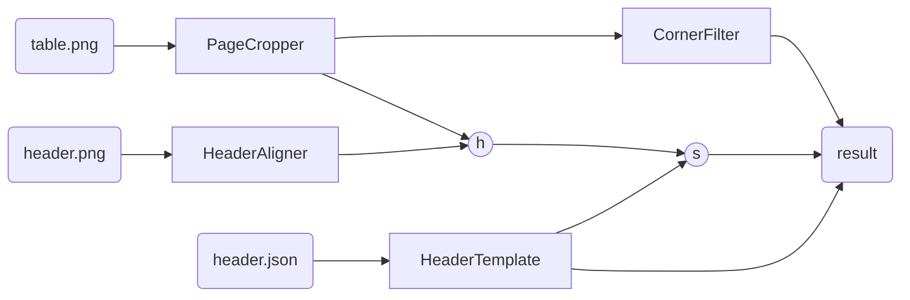

# Taulu
_segments tables from images_

## Data Requirements 

This package assumes that you are working with images of tables with **clearly visible rules**.

To use the fully-automated workflow as-is, your tables should have some **recognizable header**.
This header will be used to find the location of the first cell in the input image, as well as the expected widths of the 
cells of the table.

In order for the segmentation to work properly, your tables need to be rotated such that the rules are approximately vertical and horizontal. The pages can be slightly warped, within reason.


## Installation

### pip
```sh
pip install git+https://github.com/ghentcdh/taulu.git
```

### uv
```sh
uv add git+https://github.com/ghentcdh/taulu.git
```

## Usage

This package has a modular structure, defining multiple classes that can work together.

The usual flow looks something like this:



The components are:

- `HeaderAligner`: this component uses template matching to find the location of the header in the input images.
- `PageCropper`: optional component that crops the image to a region where some colour exists. This is a very simple component and is not necessary when your images don't contain a lot of background.
- `HeaderTemplate`: this component holds information about the template of the table, by reading an annotation `json` file.
You can make such a file by running `HeaderTemplate.annotate_image` on a cropped image of your table's header.
- `CornerFilter`: this component filters the input image and finds locations of intersections of horizontal and vertical rules.
- `h` is a transformation matrix to go from points in the header template to the input image
- `s` is the starting point of the segmentation algorithm (most often the left-top intersection, just below the header).

In short, the algorithm looks for the location of the header in the input image, in order to find a starting point.
Then, it iterates over the image starting from that point to find the intersections of the rules, and segments the image in to cells accordingly.

The result is a `TableCrosses` object, which holds the detected intersections and allows you to segment the image into rows / columns / cells / ...

example code:

```py
from pathlib import Path

from taulu.page_cropper import PageCropper
from taulu.header_aligner import HeaderAligner
from taulu.header_template import HeaderTemplate
from taulu.corner_filter import CornerFilter

cropper = PageCropper(
    target_hue=12,
    target_s=26,
    target_v=230,
    tolerance=40,
    margin=140,
    split=0.5,
    split_margin=0.06,
)
aligner = HeaderAligner("header.png")
filter = CornerFilter(
    kernel_size=41, cross_width=6, morph_size=4, region=60, k=0.05
)
template = HeaderTemplate.from_saved("header.json")

# crop the input image (this step is only necessary if the image contains more than just the table)
cropped = cropper.crop("table.png")
h = aligner.align(cropped)

# find the intersections of rules in the image
# the `True` parameter means that intermediate results are shown too, for debugging and parameter tuning
filtered = filter.apply(im, True)

# define the start point as the intersection of the first 
start_point_template = template.intersection((1, 0))
start_point_cropped = aligner.template_to_img(h, start_point_template)

table_structure = filter.find_table_points(
    im, 
    start_point_template, 
    template.cell_widths(), 
    template.cell_height()
)

table_structure.show_cells(im)
```

using this setup, `table_structure`'s methods can be used to segments the image into its cells
