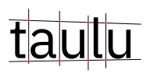
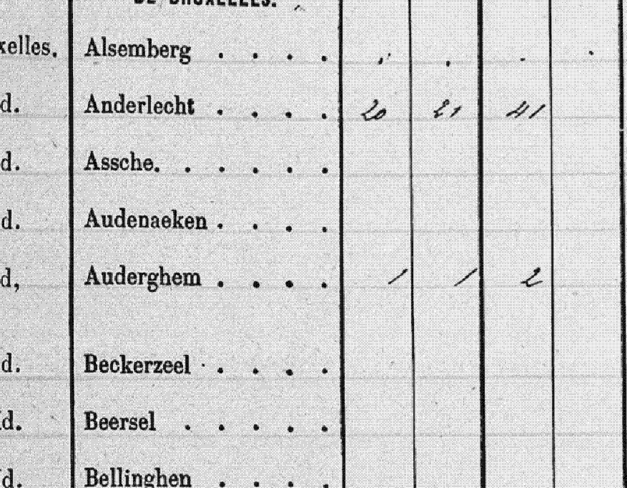
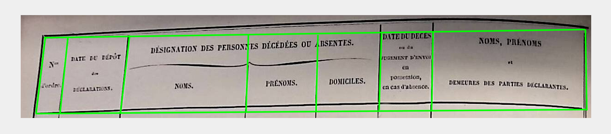
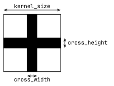
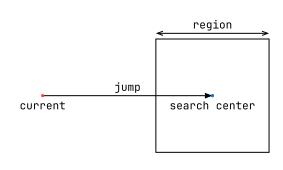

<p align="center">
  
    <picture>
  <source media="(prefers-color-scheme: dark)" srcset="./data/banner-dark.svg">
  
</picture>
  <br>
  <i>Segmentation of tables from images</i>
  <br>
  <br>
  <a href="https://pypi.org/project/taulu/">
    
  </a>
  
  <a href="https://github.com/ghentcdh/taulu/blob/main/LICENSE">
    
  </a>
  <a href="https://ghentcdh.github.io/taulu">
    
  </a>
  <br>
  <a href="https://colab.research.google.com/github/ghentcdh/taulu/blob/main/examples/demo.ipynb">
    
  </a>
  <a href="https://doi.org/10.5281/zenodo.20311441">
    
  </a>
</p>

<p align="center">
  
</p>

<p align="center">
  <a href="https://ghentcdh.github.io/taulu">Documentation</a>
  ·
  <a href="./CHANGELOG.md">Changelog</a>
  ·
  <a href="./examples">Examples</a>
  ·
  <a href="https://colab.research.google.com/github/ghentcdh/taulu/blob/main/examples/demo.ipynb">Colab demo</a>
</p>

> [!WARNING]
> **v3.0** renamed several classes and parameters. See the [migration guide](./CHANGELOG.md#300---2026-03-25) and run `uv run -m taulu.migrate config.toml --inplace` to upgrade TOML configs.

## Features

- **Rust core** (PyO3) for grid growing, A\* pathfinding, row detection
- **Two-page tables** via `Split` — different headers and parameters per side
- **Auto row heights** detected from cross-correlation peaks
- **TOML config** with JSON Schema for editor autocomplete
- **Notebook UI** for header annotation and cell inspection (matplotlib + ipywidgets)
- **OpenCV debug view** for live parameter tuning

## Data Requirements

Images of tables with **clearly visible rules** (cell borders).

For the automated workflow, tables should include a recognizable header — used to locate the first cell and infer column widths.

Tables should be roughly axis-aligned. Minor warping is fine.

## Installation

```bash
pip install taulu
# or
uv add taulu
```

## Quickstart

```python
from taulu import Taulu

Taulu.annotate("table.png", "header.png")          # one-time, interactive
taulu = Taulu("header.png")
grid = taulu.segment_table("table.png")
grid.show_cells("table.png")                        # click cells to inspect
```

For two-page (split) tables, see [`examples/example.py`](./examples/example.py).

## Workflow

`Taulu` orchestrates these components:

| Class             | Role                                                               |
| ----------------- | ------------------------------------------------------------------ |
| `TemplateMatcher` | Locate the header in the image (ORB / SIFT / AKAZE)                |
| `TableTemplate`   | Header annotation: column rules + expected cell sizes              |
| `TableDetector`   | Find rule intersections (binarization → morphology → cross-kernel) |
| `SegmentedTable`  | Output grid: cell lookups, cropping, persistence                   |

Annotation is two clicks per line:



## Parameters

Most-tuned `Taulu(...)` parameters:

| Parameter                                    | Purpose                                                                                    |
| -------------------------------------------- | ------------------------------------------------------------------------------------------ |
| `template_path`                              | Header image (`.png` + `.json` annotation). Pass `Split(...)` for two-page tables.         |
| `intersection_kernel_size`, `line_thickness` | Shape the cross-kernel to match real corner geometry after morphology.                     |
| `line_gap_fill`                              | Dilation size — bridges broken rules. Affects optimal `line_thickness`.                    |
| `search_radius`                              | Search window around predicted corner. Larger = more warp tolerance, more false positives. |
| `binarization_sensitivity`                   | Sauvola threshold. Higher = more aggressive noise removal.                                 |
| `row_height_factor`                          | Row height as fraction of header height. Float or list.                                    |
| `auto_row_heights`                           | Detect per-row heights from cross-correlation peaks.                                       |

Cross-kernel shape vs. search region:

<p align="center">
  
  &nbsp;&nbsp;&nbsp;
  
</p>

> [!TIP]
> Run with `debug_view=True` to see binarization, morphology, and search regions live — easiest way to tune.

Full parameter docs: [`Taulu` reference](https://ghentcdh.github.io/taulu/taulu.html#Taulu).

## `SegmentedTable` methods

| Method                      | Purpose                                          |
| --------------------------- | ------------------------------------------------ |
| `save` / `from_saved`       | Persist grid to/from JSON                        |
| `cell((x, y))`              | Pixel → `(row, col)`                             |
| `cell_polygon((r, c))`      | Cell → 4-corner polygon                          |
| `region(start, end)`        | Bounding polygon over a cell range               |
| `crop_cell` / `crop_region` | Perspective-correct crop                         |
| `highlight_all_cells`       | Render all cell outlines                         |
| `show_cells`                | Interactive click-to-inspect (OpenCV / notebook) |

## Configuration via TOML

```toml
"$schema" = "./taulu-config.schema.json"
template_path = "header.png"
binarization_sensitivity = 0.05
intersection_kernel_size = 41

[search_radius]                   # per-side override (split tables)
left = 60
right = 80
```

```python
from taulu import Taulu, TauluConfig
taulu = Taulu.from_config(TauluConfig.from_toml("config.toml"))
```

Generate the schema for editor autocomplete:

```bash
uv run -m taulu.schema > taulu-config.schema.json
```

## Citation

```bibtex
@software{taulu,
  author  = {Peeters, Miel and {GhentCDH}},
  title   = {taulu: segmentation of tables from images},
  url     = {https://github.com/ghentcdh/taulu},
  version = {3.0.0},
  year    = {2026}
}
```

See [`CITATION.cff`](./CITATION.cff).

---

<div align="center">

Development by <a href="https://www.ghentcdh.ugent.be/">Ghent Centre for Digital Humanities — Ghent University</a>.<br>
Funded by the <a href="https://www.ghentcdh.ugent.be/projects">GhentCDH research projects</a>, within the <a href="https://clariahvl.hypotheses.org/">CLARIAH-VL</a> consortium.

<br>

<br>

</div>
