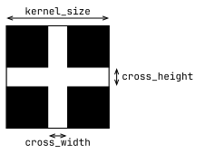

# Taulu
_Segmentation of tables from images_

## Data Requirements 

This package assumes that you are working with images of tables that have **clearly visible rules** (the lines that divide the table into cells).

To fully utilize the automated workflow, your tables should include a recognizable header. This header will be used to identify the position of the first cell in the input image and determine the expected widths of the table's cells.

For optimal segmentation, ensure that the tables are rotated so the borders are approximately vertical and horizontal. Minor page warping is acceptable.


## Installation

### Using pip
```sh
pip install git+https://github.com/ghentcdh/taulu.git
```

### Using uv
```sh
uv init my_taulu_project;
cd my_taulu_project;
uv add git+https://github.com/ghentcdh/taulu.git;
```


## Workflow

This package is structured in a modular way, with several components that work together.

The algorithm identifies the header's location in the input image, which provides a starting point. From there, it scans the image to find intersections of the rules (borders) and segments the image into cells accordingly.

The output is a `TableCrosses` object that contains the detected intersections, enabling you to segment the image into rows, columns, and cells.

Here is a visualization of the workflow and the components:


The components are:

- `HeaderAligner`: Uses template matching to identify the header's location in the input images.
- `PageCropper`: An optional component that crops the image to a region containing a given color. This is useful if your image contains a lot of background, but can be skipped if the table occupies most of the image. Only works if your table has a distinct color from the background.
- `HeaderTemplate`: Stores table template information by reading an annotation JSON file. You can create this file by running `HeaderTemplate.annotate_image` on a cropped image of your table’s header.
You can make such a file by running `HeaderTemplate.annotate_image` on a cropped image of your table's header.
- `CornerFilter`: Processes the image to identify intersections of horizontal and vertical lines (borders).
- `h`: A transformation matrix that maps points from the header template to the input image.
- `s`: The starting point of the segmentation algorithm (typically the top-left intersection, just below the header).

example code:

```py
from pathlib import Path
import os

from cv2 import imread
from taulu.img_util import show
from taulu.header_aligner import HeaderAligner
from taulu.header_template import HeaderTemplate
from taulu.corner_filter import CornerFilter


def main():
    aligner = HeaderAligner("header.png")
    filter = CornerFilter(
        # these are the most important parameters to tune
        kernel_size=41, cross_width=10, morph_size=7, region=60, k=0.45
    )
    template = HeaderTemplate.from_saved("header.json")

    # crop the input image (this step is only necessary if the image contains more than just the table)
    table = imread("table.png")
    h = aligner.align(table)

    # find the intersections of rules in the image
    # the `True` parameter means that intermediate results are shown too, for debugging and parameter tuning
    filtered = filter.apply(table, True)
    show(filtered)

    # define the start point as the intersection of the first
    left_top_template = template.intersection((1, 0))
    left_top_template = (int(left_top_template[0]), int(left_top_template[1])) # round the floats to integers
    left_top_table = aligner.template_to_img(h, left_top_template)

    table_structure = filter.find_table_points(
        table,
        left_top_table,
        # 0 means that we start from the first column 
        template.cell_widths(0),
        # 0.8 means that the height of the cells is approx. 0.8 times the height of the header 
        template.cell_height(0.8),
    )

    # you can click the cells to verify that the algorithm works
    table_structure.show_cells(table)


def setup():
    # annotate your header 
    template = HeaderTemplate.annotate_image("header.png")
    template.save(Path("header.json"))


if __name__ == "__main__":
    if not os.path.exists("header.png"):
        print("You need to supply your own header image (header.png)")
        exit(1)

    if not os.path.exists("table.png"):
        print("You need to supply your own table image (table.png)")
        exit(1)

    if not os.path.exists("header.json"):
        print("Annotating your header.png image using OpenCV...")
        setup()
        
    main()
```

## Parameters

The taulu algorithm has a few parameters which you might need to tune in order for it to fit your data's characteristics.
The following is a summary of the most important parameters and how you could tune them to your data.

- `CornerFilter` > `kernel_size`, `cross_width`, `cross_height`: The CornerFilter uses a kernel to detect intersections of rules in the image. That corner looks like this:
  
- TODO
